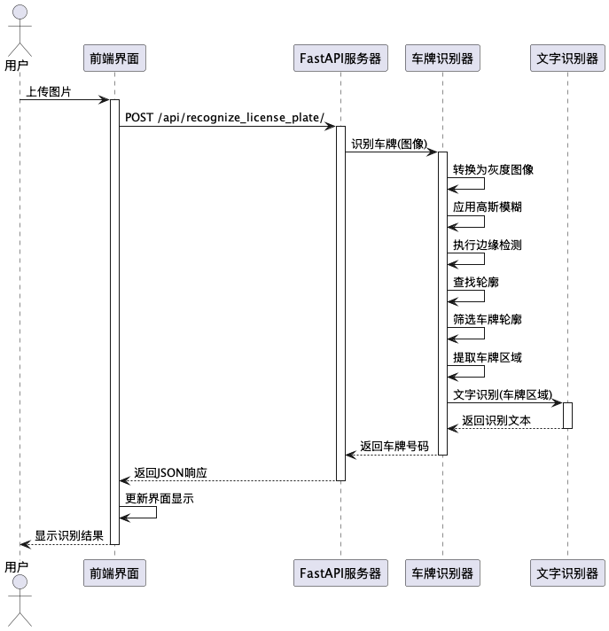

<div align="center">
    
    <h1>篆识车号 (License Plate Recognition)</h1>
    <p>这是一个基于计算机视觉的中国车牌识别系统，使用 FastAPI 构建后端服务，提供简单的 Web 界面进行车牌图片上传和识别。</p>
  <p>
    
    
    
    
  </p>
  
  <p> 
 
  </p>
</div>

## 功能特点
- 支持中国标准车牌识别
- 实时图像处理和文字识别
- 简洁的Web上传界面
- RESTful API接口
- 支持多种图片格式(JPG、PNG、JPEG、WEBP)

## 技术栈
- FastAPI (后端框架)
- OpenCV (图像处理)
- PaddleOCR (文字识别)
- TailwindCSS (前端样式)

## 安装要求
- Python 3.8+
- OpenCV
- PaddleOCR
- FastAPI
- uvicorn

## 快速开始
1. 安装依赖:
```bash
pip install -r requirements.txt
````

2. 启动服务器:

```bash
uvicorn main:app --reload --port 8080 --host 0.0.0.0
```

3. 访问 Web 界面:
   打开浏览器访问 `http://localhost:8000`

## API 接口

### 车牌识别

- 端点: `/api/recognize_license_plate/`
- 方法: POST
- 参数: 图片文件
- 返回: JSON 格式的识别结果

## 编译逻辑算法


## 使用演示


## 许可证

本项目采用 **木兰宽松许可证 (Mulan PSL)** 进行许可。  
有关详细信息，请参阅 [LICENSE](LICENSE) 文件。  
（魔法契约要保管好哟~）

[](http://license.coscl.org.cn/MulanPSL2)

## 🌟 开源项目赞助计划

### 用捐赠助力发展

感谢您使用本项目！您的支持是开源持续发展的核心动力。  
每一份捐赠都将直接用于：  
✅ 服务器与基础设施维护（魔法城堡的维修费哟~）  
✅ 新功能开发与版本迭代（魔法技能树要升级哒~）  
✅ 文档优化与社区建设（魔法图书馆要扩建呀~）

点滴支持皆能汇聚成海，让我们共同打造更强大的开源工具！  
（小仙子们在向你比心哟~）

---

### 🌐 全球捐赠通道

#### 国内用户

<div align="center" style="margin: 40px 0">

<div align="center">
<table>
<tr>
<td align="center" width="300">

<br />
<strong>🔵 支付宝</strong>（小企鹅在收金币哟~）
</td>
<td align="center" width="300">

<br />
<strong>🟢 微信支付</strong>（小绿龙在收金币哟~）
</td>
</tr>
</table>
</div>
</div>

#### 国际用户

<div align="center" style="margin: 40px 0">
  <a href="https://qr.alipay.com/fkx19369scgxdrkv8mxso92" target="_blank">
    
  </a>
  
  <a href="https://ko-fi.com/F1F5VCZJU" target="_blank">
    
  </a>
  
  <a href="https://www.paypal.com/paypalme/ctkqiang" target="_blank">
    
  </a>
  
  <a href="https://donate.stripe.com/00gg2nefu6TK1LqeUY" target="_blank">
    
  </a>
</div>

---

### 📌 开发者社交图谱

#### 技术交流

<div align="center" style="margin: 20px 0">
  <a href="https://github.com/ctkqiang" target="_blank">
    
  </a>
  
  <a href="https://stackoverflow.com/users/10758321/%e9%92%9f%e6%99%ba%e5%bc%ba" target="_blank">
    
  </a>
  
  <a href="https://www.linkedin.com/in/ctkqiang/" target="_blank">
    
  </a>
</div>

#### 社交互动

<div align="center" style="margin: 20px 0">
  <a href="https://www.instagram.com/ctkqiang" target="_blank">
    
  </a>
  
  <a href="https://twitch.tv/ctkqiang" target="_blank">
    
  </a>
  
  <a href="https://github.com/ctkqiang/ctkqiang/blob/main/assets/IMG_9245.JPG?raw=true" target="_blank">
    
  </a>
</div>

---

🙌 感谢您成为开源社区的重要一员！  
💬 捐赠后欢迎通过社交平台与我联系，您的名字将出现在项目致谢列表！  
（小仙子们在向你撒花哟~）
